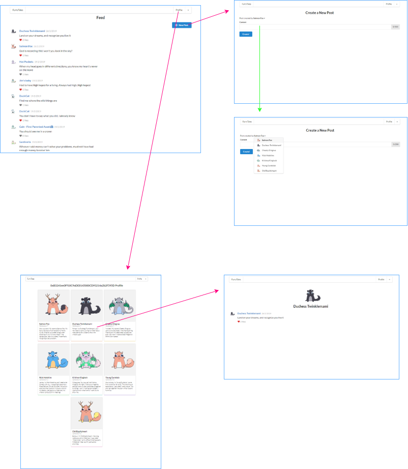

# FurryTales

Social media for CryptoKitties.
Basic version for a tutorial I wrote - https://medium.com/@karin.chechik/create-a-blockchain-app-on-ethereum-dapp-with-react-and-solidity-a8f8c77b09a8

Result - http://furrytales.herokuapp.com/

Note: It takes some time to load at first because of the server side rendering (and you might need to refresh). Also, when you create a new post or like a post — it takes about 20 seconds to finish the action because it is sending the transaction to the blockchain.

